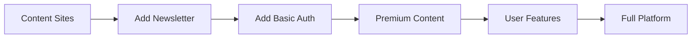

# Quest Platform Architecture
## Content-First Microservices with SEO Focus

**Version**: 3.0.0  
**Date**: January 2025  
**Status**: Content & SEO Prioritized

---

## Executive Summary

Quest Platform is a network of specialist content sites that build SEO authority in specific verticals. Starting with TheChief (executive coaching), we'll create authoritative content sites powered by Payload CMS and MCP for AI-assisted content creation. Authentication and user features come later - content and SEO come first.

**Core Philosophy**: Ship content sites fast, build SEO authority, add complexity only when needed.

---

## Strategic Pivot: Content First, Auth Later

### Why This Approach Works
1. **Faster to Market** - No auth complexity blocking launch
2. **SEO Value Immediately** - Start building domain authority now
3. **Simpler Development** - Focus on content and MCP integration
4. **Prove Value** - Show AI content creation works before adding users
5. **Revenue Faster** - Monetize through content/ads before building platform

### The Vision
```
Multiple specialist sites building authority:
- thechief.quest → Executive coaching content
- tractorinsurance.quest → Insurance guides
- questcareer.com → Career development
- [vertical].quest → Specialist content sites
```

---

## Revised Architecture

```
/Users/dankeegan/
├── LEGACY-*/                    # Archived projects
├── quest-core-v2/              # Reference for future user features
│
└── quest-platform/
    ├── sites/                  # Content sites (START HERE)
    │   ├── thechief/          # Executive coaching site
    │   │   ├── app/           # Next.js frontend
    │   │   ├── public/        # Static assets
    │   │   └── content/       # MDX/content files
    │   │
    │   ├── tractor/           # Insurance site
    │   └── [future-sites]/    # Additional verticals
    │
    ├── services/              # Shared services
    │   ├── cms/              # Payload CMS (PRIORITY)
    │   │   ├── collections/  # Content types
    │   │   ├── admin/        # Admin UI
    │   │   └── api/          # Content API
    │   │
    │   ├── mcp/              # MCP Server (PRIORITY)
    │   │   ├── tools/        # Content creation tools
    │   │   ├── prompts/      # Site-specific prompts
    │   │   └── api/          # MCP endpoints
    │   │
    │   └── future/           # Add later
    │       ├── auth/         # User auth (LATER)
    │       ├── voice/        # Voice features (LATER)
    │       └── memory/       # User memory (LATER)
    │
    └── shared/               # Shared resources
        ├── ui/               # Reusable components
        ├── seo/              # SEO utilities
        └── content/          # Content templates
```

---

## Implementation Phases (Revised)

### Phase 1: TheChief Content Site (Week 1)
**Goal**: Get a content site live for SEO

```bash
# Simple Next.js site - NO AUTH
cd quest-platform/sites/thechief
npx create-next-app@latest . --typescript --tailwind --app

# Just these features:
- Landing page with content
- Blog/article pages
- SEO optimization
- Static generation for speed
- Deploy to Vercel immediately
```

**Success Criteria**: 
- Site is live and indexed by Google
- Loading speed < 1 second
- Perfect Lighthouse scores

### Phase 2: Payload CMS Integration (Week 2)
**Goal**: Content management system working

```bash
cd quest-platform/services/cms
npx create-payload-app@latest . --template blank

# Configure for content:
- Articles collection
- Pages collection
- Media management
- SEO fields
- No user authentication needed yet
```

**Success Criteria**:
- Admin panel works
- Can create/edit content
- API serves content to TheChief site

### Phase 3: MCP Integration (Week 3)
**Goal**: AI-assisted content creation

```bash
cd quest-platform/services/mcp
npm init -y
npm install @modelcontextprotocol/sdk

# MCP tools for content:
- createArticle
- generateSEOMetadata
- suggestTopics
- improveContent
```

**Integration with Payload**:
```typescript
// MCP creates content directly in Payload
const createArticle = async (topic: string) => {
  // Generate content
  const content = await generateContent(topic)
  
  // Save to Payload CMS
  const article = await payload.create({
    collection: 'articles',
    data: {
      title: content.title,
      content: content.body,
      seo: content.seo
    }
  })
  
  return article
}
```

### Phase 4: Additional Sites (Week 4+)
**Goal**: Replicate for other verticals

```bash
# Copy TheChief structure
cp -r sites/thechief sites/tractor

# Customize for vertical:
- Different content focus
- Industry-specific SEO
- Unique design/branding
- Share CMS/MCP infrastructure
```

### Phase 5: User Features (LATER - Only When Needed)
**Goal**: Add authentication and user features

```bash
# Only after content sites are successful:
- User registration
- Saved articles
- Personalization
- Premium content
```

---

## Content & SEO Strategy

### Content Architecture
```yaml
Each Site Focuses On:
  - 50-100 cornerstone articles (2000+ words)
  - Daily blog posts (AI-generated via MCP)
  - Resource pages and guides
  - Industry-specific tools/calculators

SEO Optimization:
  - Static generation for speed
  - Schema markup for rich snippets
  - XML sitemaps
  - Internal linking strategy
  - Mobile-first design
```

### MCP Content Creation Workflow
```typescript
// Daily content generation via MCP
const dailyContentWorkflow = async (site: string) => {
  // 1. Get trending topics
  const topics = await mcp.getTrendingTopics(site)
  
  // 2. Generate articles
  for (const topic of topics) {
    const article = await mcp.createArticle({
      site,
      topic,
      style: siteConfig[site].contentStyle,
      seoKeywords: await mcp.suggestKeywords(topic)
    })
    
    // 3. Publish to CMS
    await cms.publish(article)
  }
  
  // 4. Update sitemap
  await updateSitemap(site)
}
```

---

## Service Communication (Simplified)

```typescript
// Sites pull content from CMS
const getArticles = async () => {
  const response = await fetch(`${CMS_URL}/api/articles`)
  return response.json()
}

// MCP pushes content to CMS
const createContent = async (content) => {
  await fetch(`${CMS_URL}/api/articles`, {
    method: 'POST',
    body: JSON.stringify(content)
  })
}

// No auth needed initially - just content APIs
```

---

## Technology Stack (Simplified)

### Phase 1-3 Stack (Essential)
```json
{
  "sites/thechief": {
    "next": "15.x",
    "react": "19.x",
    "tailwindcss": "3.x",
    "@next/mdx": "latest",
    "next-seo": "latest"
  },
  
  "services/cms": {
    "payload": "3.x",
    "@payloadcms/db-postgres": "3.x",
    "@payloadcms/richtext-lexical": "3.x"
  },
  
  "services/mcp": {
    "@modelcontextprotocol/sdk": "latest",
    "openai": "latest",
    "zod": "3.x"
  }
}
```

### Phase 5 Stack (Add Later)
```json
{
  "future": {
    "better-auth": "latest",
    "@humeai/voice": "latest",
    "@getzep/zep-js": "latest",
    "prisma": "latest"
  }
}
```

---

## MCP Integration for Content

### MCP Tools for Content Creation
```typescript
// services/mcp/tools.ts
export const contentTools = {
  // Content generation
  createArticle: {
    description: "Create SEO-optimized article",
    parameters: {
      topic: "string",
      keywords: "string[]",
      length: "number"
    }
  },
  
  // SEO optimization
  generateMetadata: {
    description: "Generate SEO metadata",
    parameters: {
      content: "string",
      targetKeywords: "string[]"
    }
  },
  
  // Content improvement
  improveContent: {
    description: "Enhance existing content",
    parameters: {
      content: "string",
      improvements: "string[]"
    }
  },
  
  // Topic research
  suggestTopics: {
    description: "Suggest trending topics",
    parameters: {
      vertical: "string",
      count: "number"
    }
  }
}
```

### Claude Desktop Configuration
```json
{
  "mcpServers": {
    "quest-content": {
      "command": "node",
      "args": [
        "/Users/dankeegan/quest-platform/services/mcp/server.js"
      ],
      "env": {
        "CMS_URL": "http://localhost:3001",
        "OPENAI_API_KEY": "your-key"
      }
    }
  }
}
```

---

## Deployment Strategy

### Simple Deployment per Site
```yaml
Vercel Projects:
  - thechief.quest → sites/thechief
  - cms.thechief.quest → services/cms
  - tractorinsurance.quest → sites/tractor

Environment Variables:
  CMS_URL: https://cms.thechief.quest
  NEXT_PUBLIC_SITE_URL: https://thechief.quest
```

### Cost Structure (Simplified)
```yaml
Initial Costs (Phase 1-3):
  - Vercel (multiple sites): $20/month
  - Neon (one database): $20/month
  - Domain names: $10/year each
  - Total: ~$40/month

AI Costs (usage-based):
  - OpenAI API: ~$50/month for content generation
  - MCP server: Runs locally (free)
```

---

## Success Metrics

### Phase 1 (Content Site)
- [ ] Site live and accessible
- [ ] 10+ initial articles published
- [ ] Google Search Console verified
- [ ] Page speed > 95 on Lighthouse

### Phase 2 (CMS)
- [ ] Admin panel functional
- [ ] Content API working
- [ ] Media uploads working
- [ ] SEO fields configured

### Phase 3 (MCP)
- [ ] Claude Desktop connected
- [ ] Can create articles via MCP
- [ ] Content quality acceptable
- [ ] 5+ articles created via AI

### Long-term SEO Goals
- [ ] 100+ indexed pages within 3 months
- [ ] 1000+ organic visitors/month within 6 months
- [ ] Domain Authority > 20 within 1 year
- [ ] Multiple sites ranking for target keywords

---

## Benefits of Content-First Approach

### Immediate Value
✅ **Live sites quickly** - Start building SEO immediately
✅ **Simpler development** - No auth complexity
✅ **Faster iteration** - Ship content daily
✅ **Revenue potential** - Ads/affiliate from day one
✅ **Prove concept** - Show MCP content creation works

### Technical Benefits
✅ **Clean separation** - Content sites independent
✅ **Easy scaling** - Copy site structure for new verticals
✅ **Low complexity** - Just content and SEO
✅ **Clear focus** - Content quality over features
✅ **Cost effective** - Minimal infrastructure needed

---

## Migration Path from Content to Platform



Only add complexity as needed, based on user demand.

---

## Common Patterns for Content Sites

### SEO-Optimized Page Structure
```typescript
// Every page includes
export const metadata = {
  title: 'Page Title | TheChief',
  description: 'Meta description',
  openGraph: { /* ... */ },
  twitter: { /* ... */ },
}

// Static generation for speed
export const revalidate = 3600 // Revalidate every hour
```

### Content Collection Schema
```typescript
// Payload CMS schema for articles
const Articles = {
  slug: 'articles',
  fields: [
    { name: 'title', type: 'text', required: true },
    { name: 'slug', type: 'text', required: true },
    { name: 'content', type: 'richText' },
    { name: 'excerpt', type: 'textarea' },
    { name: 'seo', type: 'group', fields: [
      { name: 'title', type: 'text' },
      { name: 'description', type: 'textarea' },
      { name: 'keywords', type: 'text' }
    ]},
    { name: 'publishedAt', type: 'date' }
  ]
}
```

---

## Next Steps

### Week 1: Launch TheChief
1. Create simple Next.js site
2. Add 10 cornerstone articles
3. Deploy to Vercel
4. Submit to Google Search Console
5. Start tracking analytics

### Week 2: Add CMS
1. Set up Payload CMS
2. Migrate content to CMS
3. Connect site to CMS API
4. Test content workflow

### Week 3: Enable MCP
1. Build MCP content tools
2. Connect to Claude Desktop
3. Generate first AI articles
4. Refine content quality

### Week 4: Scale
1. Launch second site (Tractor)
2. Share CMS infrastructure
3. Customize for vertical
4. Repeat success pattern

---

## Conclusion

By focusing on content and SEO first, we can:
1. Ship valuable sites immediately
2. Build domain authority while developing platform features
3. Generate revenue through content
4. Prove the MCP content creation concept
5. Add user features only when there's clear demand

The key insight: **Content sites with good SEO are valuable on their own. The platform features can come later.**

---

*"Ship content, build authority, add features later."*