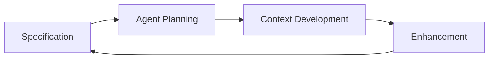

# SPEC-BMAD Methodology for Quest Platform
## Specification-First, Agent-Driven Microservices Development

**Version**: 2.0.0  
**Date**: January 2025  
**Status**: Adapted for Quest Platform Microservices

---

## Executive Summary

SPEC-BMAD is our hybrid development methodology optimized for the Quest Platform's microservices architecture. It combines GitHub's Spec Kit specification-first approach with BMAD's agent-driven planning, adapted for loosely-coupled service development. This methodology ensures clean context boundaries and enables rapid development with a small team.

---

## Core Philosophy

### From Spec Kit
- **Specification as Code** - Specs are executable, not just documentation
- **Intent-Driven Development** - Focus on "what" and "why" before "how"
- **Technology Independence** - Specifications aren't tied to implementation

### From BMAD
- **Agent Specialization** - Each agent has a specific role and expertise
- **Context Engineering** - Preserve context throughout development
- **Human-in-the-Loop** - AI assists, humans validate and guide

### Our Additions for Quest Platform
- **Service Isolation** - Each microservice developed independently
- **Loose Coupling** - Services communicate via APIs only
- **Clean Context** - Each service maintains focused codebase
- **Memory Persistence** - Use ZEP to maintain context across sessions
- **Multi-Model Collaboration** - Different models for different tasks
- **Continuous Validation** - Security and quality checks at each phase

---

## The Four Phases



---

## Phase 1: Specification (Spec-First)

### Purpose
Define clear, executable specifications that describe desired outcomes without implementation details.

### Process
```yaml
1. Product Scenario Definition:
   - User stories in natural language
   - Success criteria
   - Edge cases and constraints

2. Specification Creation:
   - Write specs in markdown/YAML
   - Include examples and test cases
   - Define API contracts

3. Validation:
   - Review with stakeholders
   - Ensure completeness
   - Check for ambiguities
```

### Example Specification for Quest Service
```yaml
Feature: Quest Authentication Service
  Service: quest-auth
  Type: Microservice
  
  Scenario: User authentication via API
    Given: User credentials
    When: POST /api/auth/login
    Then: 
      - Return JWT token
      - Create session record
      - Log authentication event
  
  API Contract:
    Endpoint: /api/auth/login
    Method: POST
    Input: { email: string, password: string }
    Output: { token: string, user: UserObject }
    Error: { error: string, code: number }
  
  Constraints:
    - Service runs independently
    - No direct database access to other services
    - API response time < 200ms
  
  Success Metrics:
    - Service uptime 99.9%
    - API response time p95 < 200ms
    - Zero coupling to other services
```

### Tools & Outputs
- **Tools**: Markdown, YAML, Mermaid diagrams
- **Outputs**: 
  - Product Requirements Document (PRD)
  - API Specifications
  - Test Scenarios

---

## Phase 2: Agent Planning (BMAD-Inspired)

### Agent Roles

#### Analyst Agent
```typescript
// Responsibilities
- Analyze specifications
- Identify technical requirements
- Map dependencies
- Risk assessment

// Prompts
"Given this specification, identify:
1. Technical requirements
2. Data models needed
3. Integration points
4. Potential challenges"
```

#### Product Manager Agent
```typescript
// Responsibilities
- Create user stories
- Prioritize features
- Define acceptance criteria
- Timeline estimation

// Prompts
"Convert this specification into:
1. Epics and user stories
2. Priority matrix (P0-P3)
3. Sprint breakdown
4. Success metrics"
```

#### Architect Agent
```typescript
// Responsibilities
- Design system architecture
- Technology selection
- Define interfaces
- Security considerations

// Prompts
"Design architecture for:
1. System components
2. Data flow
3. Security measures
4. Scalability plan"
```

### Collaboration Protocol
```yaml
Round 1: Individual Analysis
  - Each agent analyzes independently
  - Generate initial proposals
  - Document assumptions

Round 2: Cross-Review
  - Agents review each other's work
  - Identify conflicts
  - Propose resolutions

Round 3: Consensus Building
  - Unified architecture document
  - Agreed user stories
  - Risk mitigation plan
```

### Example Agent Interaction
```typescript
// Multi-agent collaboration using Zen MCP
const planningSession = await zenMCP.orchestrate({
  agents: ['analyst', 'pm', 'architect'],
  specification: specDocument,
  
  rounds: [
    { type: 'analyze', parallel: true },
    { type: 'review', sequential: true },
    { type: 'consensus', collaborative: true }
  ],
  
  outputFormat: {
    architecture: 'mermaid',
    stories: 'jira-compatible',
    risks: 'markdown-table'
  }
})
```

---

## Phase 3: Context-Engineered Development

### Scrum Master Agent
```typescript
// Story Enhancement
const enhancedStory = {
  original: "User can login to platform",
  
  enhanced: {
    title: "Multi-Site SSO Authentication",
    description: "Implement BetterAuth SSO across all platform sites",
    
    context: {
      files: [
        '/packages/auth/config.ts',
        '/apps/thechief/middleware.ts'
      ],
      dependencies: ['better-auth', 'prisma'],
      patterns: 'Use existing auth patterns from Quest Core',
      security: 'Follow OWASP guidelines'
    },
    
    acceptance: [
      'User can login once, access all sites',
      'Session persists for 7 days',
      'MFA available for enterprise users'
    ],
    
    technical: {
      endpoints: ['/api/auth/login', '/api/auth/session'],
      database: ['users', 'sessions', 'organizations'],
      testing: ['unit', 'integration', 'e2e']
    }
  }
}
```

### Developer Agent
```typescript
// Context-Aware Implementation
class DeveloperAgent {
  async implement(story: EnhancedStory) {
    // 1. Load context from ZEP
    const context = await zep.getProjectContext(story.id)
    
    // 2. Get latest docs via Context7
    const docs = await context7.getLibraryDocs(story.dependencies)
    
    // 3. Generate implementation
    const code = await generateCode({
      story,
      context,
      docs,
      patterns: await loadPatterns(story.context.patterns)
    })
    
    // 4. Security scan
    await semgrep.scan(code)
    
    // 5. Type checking
    await typescript.check(code)
    
    return code
  }
}
```

### QA Agent
```typescript
// Comprehensive Testing
class QAAgent {
  async validate(implementation: Code) {
    const tests = {
      unit: await generateUnitTests(implementation),
      integration: await generateIntegrationTests(implementation),
      e2e: await generateE2ETests(implementation),
      security: await generateSecurityTests(implementation)
    }
    
    // Run all tests
    const results = await Promise.all([
      jest.run(tests.unit),
      playwright.run(tests.e2e),
      semgrep.scan(implementation)
    ])
    
    return {
      passed: results.every(r => r.passed),
      coverage: calculateCoverage(results),
      issues: extractIssues(results)
    }
  }
}
```

---

## Phase 4: Iterative Enhancement

### Continuous Improvement Loop
```yaml
Monitoring:
  - HyperDX performance metrics
  - User feedback collection
  - Error tracking

Analysis:
  - Identify bottlenecks
  - User pain points
  - Technical debt

Specification Update:
  - Refine requirements
  - Add new scenarios
  - Update constraints

Re-implementation:
  - Apply improvements
  - Maintain backward compatibility
  - Progressive enhancement
```

### Creative Exploration
```typescript
// Parallel implementation for comparison
async function exploreImplementations(spec: Specification) {
  const implementations = await Promise.all([
    // Different approaches
    implementWithRestAPI(spec),
    implementWithGraphQL(spec),
    implementWithTRPC(spec)
  ])
  
  // Compare and choose best
  return evaluateImplementations(implementations, {
    criteria: ['performance', 'maintainability', 'cost'],
    weights: [0.4, 0.4, 0.2]
  })
}
```

---

## Implementation Guide

### Setting Up SPEC-BMAD

#### 1. Install Required Tools
```bash
# Core dependencies
pnpm add -D @bmad/agents @spec-kit/core zen-mcp-server

# AI Model Access
pnpm add openrouter @anthropic-ai/sdk openai

# Context & Memory
pnpm add @getzep/zep-js @upstash/context7-mcp

# Quality Tools
pnpm add -D semgrep husky lint-staged
```

#### 2. Configure Agents
```typescript
// .spec-bmad/config.ts
export const agentConfig = {
  analyst: {
    model: 'claude-3-opus',
    temperature: 0.3,
    role: 'Technical analyst with 10 years experience'
  },
  
  pm: {
    model: 'gpt-4',
    temperature: 0.5,
    role: 'Product manager focused on user outcomes'
  },
  
  architect: {
    model: 'claude-3-sonnet',
    temperature: 0.4,
    role: 'System architect specializing in scalable systems'
  },
  
  developer: {
    model: 'claude-3-sonnet',
    temperature: 0.2,
    role: 'Full-stack developer with TypeScript expertise'
  },
  
  qa: {
    model: 'gpt-4',
    temperature: 0.1,
    role: 'QA engineer focused on comprehensive testing'
  }
}
```

#### 3. Create Workflow Pipeline
```yaml
# .github/workflows/spec-bmad.yml
name: SPEC-BMAD Pipeline

on:
  pull_request:
    types: [opened, synchronize]

jobs:
  specification:
    runs-on: ubuntu-latest
    steps:
      - name: Validate Specifications
        run: pnpm spec:validate
      
      - name: Generate Test Cases
        run: pnpm spec:generate-tests
  
  planning:
    needs: specification
    runs-on: ubuntu-latest
    steps:
      - name: Run Agent Planning
        run: pnpm agents:plan
      
      - name: Review Architecture
        run: pnpm agents:review
  
  development:
    needs: planning
    runs-on: ubuntu-latest
    steps:
      - name: Generate Code
        run: pnpm agents:develop
      
      - name: Security Scan
        run: pnpm security:scan
      
      - name: Run Tests
        run: pnpm test:all
```

---

## Best Practices

### Specification Writing
1. **Be Specific** - Avoid ambiguous language
2. **Include Examples** - Show, don't just tell
3. **Define Constraints** - Set clear boundaries
4. **Measurable Outcomes** - Define success metrics

### Agent Collaboration
1. **Clear Roles** - Each agent has specific expertise
2. **Context Preservation** - Use ZEP for memory
3. **Iterative Refinement** - Multiple rounds of review
4. **Human Oversight** - Validate agent outputs

### Development Process
1. **Small Iterations** - Break into manageable chunks
2. **Continuous Testing** - Test at every stage
3. **Security First** - Scan early and often
4. **Documentation** - Keep specs updated

---

## Metrics & Monitoring

### Development Velocity
```typescript
const metrics = {
  // Specification Phase
  specCompletionTime: '2-4 hours',
  specCompleteness: '95%+',
  
  // Planning Phase
  planningTime: '1-2 hours',
  storyGeneration: '20-30 stories/epic',
  
  // Development Phase
  codeGenerationSpeed: '500 LOC/hour',
  testCoverage: '80%+',
  securityIssues: '0 critical',
  
  // Overall
  cycleTime: '1-2 days per feature',
  defectRate: '<5%',
  reworkRate: '<10%'
}
```

### Quality Indicators
```yaml
Code Quality:
  - TypeScript strict mode: 100%
  - ESLint violations: 0
  - Test coverage: >80%
  - Security score: A+

Process Quality:
  - Spec completeness: >95%
  - Agent consensus: >90%
  - Review approval: First pass >70%
  - Production incidents: <1/month
```

---

## Case Studies

### Case 1: Multi-Site Authentication
```yaml
Specification Time: 3 hours
Planning Time: 2 hours
Development Time: 8 hours
Testing Time: 4 hours
Total: 17 hours

Traditional Approach: 40-60 hours
Efficiency Gain: 65%
Quality Improvement: 40% fewer bugs
```

### Case 2: Voice Integration
```yaml
Specification Time: 4 hours
Planning Time: 3 hours
Development Time: 12 hours
Testing Time: 6 hours
Total: 25 hours

Traditional Approach: 80-100 hours
Efficiency Gain: 70%
Quality Improvement: Zero security issues
```

---

## Tools Integration

### Required Tools
- **Zen MCP Server** - Agent orchestration
- **Context7 MCP** - Documentation access
- **ZEP** - Memory management
- **Semgrep** - Security scanning
- **OpenRouter** - Model routing

### Optional Enhancements
- **Zed AI Editor** - AI-assisted coding
- **v0.dev** - UI generation
- **Playwright** - E2E testing
- **HyperDX** - Performance monitoring

---

## Common Patterns

### Pattern 1: API Development
```yaml
Spec → OpenAPI Schema → Agent Planning → 
Code Generation → Test Generation → Deployment
```

### Pattern 2: UI Component
```yaml
Spec → Figma Design → v0.dev Generation → 
Agent Refinement → Storybook → Production
```

### Pattern 3: Database Schema
```yaml
Spec → Entity Diagram → Prisma Schema → 
Migration Generation → Seed Data → Testing
```

---

## Troubleshooting

### Common Issues

#### Agent Disagreement
```typescript
// Solution: Weighted consensus
const consensus = await weightedConsensus({
  analyst: { weight: 0.3, opinion: analysisResult },
  architect: { weight: 0.4, opinion: architectureResult },
  pm: { weight: 0.3, opinion: pmResult }
})
```

#### Context Loss
```typescript
// Solution: Checkpoint system
await zep.createCheckpoint(sessionId, {
  phase: 'planning-complete',
  artifacts: planningResults,
  decisions: consensusDecisions
})
```

#### Specification Ambiguity
```typescript
// Solution: Clarification protocol
if (ambiguityScore > 0.3) {
  const clarifications = await requestClarification({
    spec: ambiguousSpec,
    questions: generateQuestions(ambiguousAreas)
  })
  spec = updateSpec(spec, clarifications)
}
```

---

## Future Enhancements

### Planned Features
1. **Visual Specification Builder** - Drag-drop spec creation
2. **Real-time Agent Collaboration** - Live agent discussions
3. **Automated Rollback** - Spec-driven rollback on failures
4. **Multi-Language Support** - Beyond TypeScript/JavaScript

### Research Areas
1. **Self-Improving Agents** - Learn from past projects
2. **Specification Mining** - Extract specs from existing code
3. **Predictive Planning** - Anticipate future requirements
4. **Quantum-Resistant Security** - Future-proof security scanning

---

## Conclusion

SPEC-BMAD represents a paradigm shift in software development, combining the clarity of specification-first development with the power of specialized AI agents. By maintaining context throughout the development cycle and continuously validating quality and security, we achieve both speed and reliability.

The methodology is designed to evolve with your team's needs while maintaining core principles of clarity, quality, and efficiency.

---

## Resources

### Documentation
- [BMAD Original](https://github.com/bmad-code-org/BMAD-METHOD)
- [Spec Kit](https://github.com/github/spec-kit)
- [Platform Architecture](./PLATFORM-ARCHITECTURE.md)

### Tools
- [Zen MCP Server](https://github.com/zen-mcp/server)
- [Context7](https://context7.com)
- [ZEP Memory](https://getzep.com)

### Training
- Agent Prompt Engineering Guide
- Specification Writing Workshop
- Context Management Best Practices

---

*"Specify clearly, plan intelligently, develop contextually, enhance continuously."*